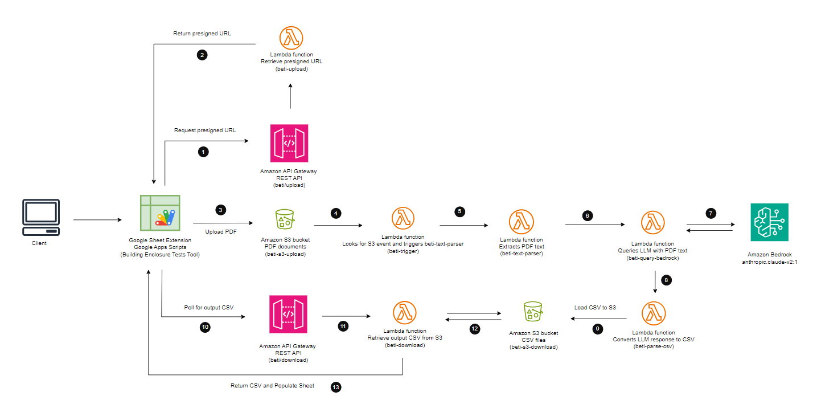

# BETI (Building Enclosure Testing & Inspections)

## Introduction

The purpose of this tool is to allow users to upload Spec Section PDFs and automatically extract relevant testing and inspection information.

This solution is deployed via Google Extensions, Google Apps Script, and AWS.

## Architecture

## To Run this Application Yourself

1. Create a new Google Sheet.
2. Open the Apps Script Macro editor.
3. Paste in the code from code.gs and sidebar.html from the frontend folder of this github repo.
4. In AWS, paste in the code from the backend folder for each respective lambda function, according to the architecture diagram.
5. Create API Gateway and S3 buckets with necessary policies according to the architecture diagram.

Eventual plans are to deploy this solution on the Google Extensions wrokspace marketplace for all Clark employees to access.

## Contributing

This repository is intended for Clark Construction Group LLC. If you have questions about the contents please reach out to the SR&D Team.

Project Leads:

Devon Trepp devon.trepp@clarkconstruction.com

Shelton Carr shelton.carrg@clarkconstruction.com

Stefanie Carlisle stefanie.carlisle@clarkconstruction.com

## Future Plans

Given additional time and resources to improve this tool, we would focus on two main areas:
1. Enhancing the PDF text extraction to only extract relevant testing and inspections text (as opposed to the whole document).
2. Strengthening the LLM prompting to return more accurate and reliable responses.

## License

---
This repository is intended for Clark Construction Group LLC and is not licensed for any external use.
